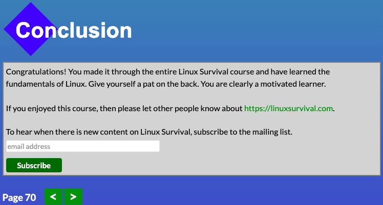
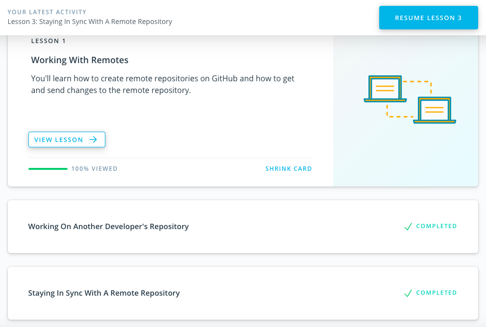

# kottans-backend

## Git and GitHub

I have read about Git before, but I have never tried running it in Terminal or for my projects, so the actual hands-on experience was new.

I was surprised that Git can be a safety net and a trap at the same time - you can use it to explore, to fix bugs, to time travel basically, but it also benevolently allows you to lose your progress with some "push --force", as if confirming "Yes, you can take this ride... to misery".

## Unix Shell

My previous experience with CLI was limited to basic commands (i.e. Modules 1-2 of Linux Survival), so almost anything beyond that point was new to me. 

I found that expansions (especially brace expansions) were surprisingly fun. Another element of surprise (okay, not that surprising) was that I need to adopt better directory naming practices, since it took me a fair amount of attempts to effectively move files between directories, with most of my attempts ending up with "No such file or directory".

I was particularly interested in redirection commands and want to use them asap.

## Git Collaboration

Practiced creating pull requests again. Enjoyed CS50 reunion. 

Got a better understanding of `git rebase -i`. 
[Learn Git Branching](learngitbranching.js.org) is starting to make a lot more sense :laughing:. 

Found some neat flags that I intend to use in my work, such as `--grep` or `git log --oneline --graph --decorate --all`.

## Python Basics 1

[HackerRank profile](https://www.hackerrank.com/jamie_ikonnikova)

Even though it took me the longest time to complete this section, I appreciate the challenge and strongly believe that practicing exercises from both sets of assignments made me a better programmer.
I have especially liked [Code Wars](https://www.codewars.com), because this resource encourages you to come up with concise and beautiful solutions, as well as [Practice Python](https://www.practicepython.org), because along with the fun exercises the materials were very helpful. 
Among new things I have encountered, were python libraries BeautifulSoup and requests. 
I was surprised at how much I’ve started to appreciate the list/dictionary comprehensions. 
I intend to use whatever is the most appropriate and applicable solution for the problems I encounter :)
